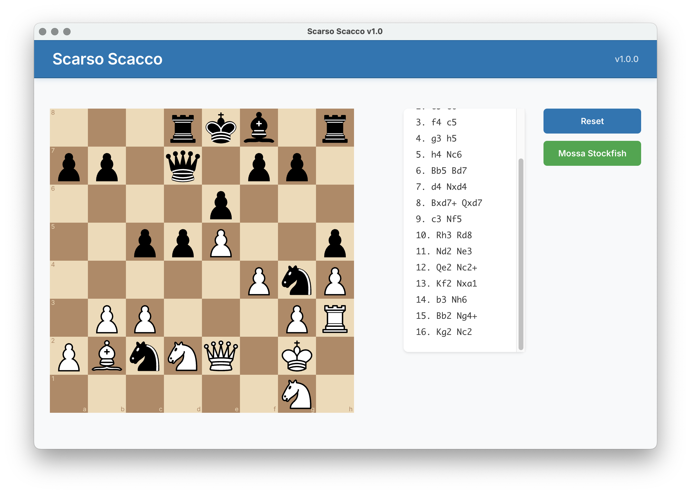

# Scarso Scacco ♟️

A modern chess application built with **Electron** and **React**, featuring integrated **Stockfish AI** engine for intelligent gameplay.



*Main interface showing the chessboard, move history, and control buttons with LinkedIn-inspired design*

> 📝 **Note:** Add your `example.png` screenshot to the `docs/` folder. See [docs/README_IMAGES.md](docs/README_IMAGES.md) for guidelines.

## 🚀 Features

- ✅ **Interactive Chess Board** - Drag and drop pieces with validation
- ✅ **Stockfish AI Integration** - Automatic AI responses using WebAssembly
- ✅ **Move History** - Track and display all moves in algebraic notation
- ✅ **Auto-scroll** - Latest moves always visible at the bottom
- ✅ **Reset Game** - Full synchronization between UI and engine
- ✅ **Modern UI** - LinkedIn-inspired theme with Inter font
- ✅ **Cross-platform** - macOS, Windows, and Linux support
- ✅ **Self-contained** - No external dependencies required
- ✅ **Version Display** - Automatic version from package.json

## 🛠️ Prerequisites

Before you begin, ensure you have the following installed:

- **Node.js** (v16 or higher) - [Download](https://nodejs.org/)
- **npm** (comes with Node.js)
- **Git** - [Download](https://git-scm.com/)

For Windows builds on macOS/Linux, Wine will be automatically downloaded.

## 📦 Installation

### 1. Clone the Repository

```bash
git clone https://github.com/your-username/chess-electron-react.git
cd chess-electron-react
```

### 2. Install Dependencies

```bash
npm install
```

## 🏃‍♂️ Development

### Quick Start (Recommended)

```bash
# Start both Vite and Electron automatically
npm run dev:electron
```

This single command will:
- Start the Vite dev server on `http://localhost:5173`
- Wait for Vite to be ready
- Automatically launch Electron with hot reload
- Enable developer tools

### Manual Start (Alternative)

```bash
# Start Vite development server
npm run dev

# In another terminal, start Electron
npm run electron
```

This allows you to start each service manually for more control.

## 🏗️ Building for Production

### Build All Platforms

```bash
npm run dist
```

### Build Specific Platforms

```bash
# macOS only
npm run dist:mac

# Windows only
npm run dist:win

# Linux only
npm run dist:linux
```

### Build Web Assets Only

```bash
npm run build
```

## 📁 Output Files

After building, you'll find the distributables in the `dist/` folder:

### macOS
- `Scarso Scacco-1.0.0-arm64.dmg` - DMG installer for Apple Silicon
- `Scarso Scacco-1.0.0-x64.dmg` - DMG installer for Intel Macs

### Windows
- `Scarso Scacco Setup 1.0.0.exe` - NSIS installer (x64 + x86)
- `Scarso Scacco 1.0.0.exe` - Portable executable (x64 only)

### Linux
- `Scarso Scacco-1.0.0.AppImage` - Universal Linux package

## 🎮 How to Play

1. **Make Your Move** - Drag and drop pieces on the board
2. **AI Response** - Stockfish automatically plays the best response
3. **View History** - See all moves in the right panel
4. **Manual AI Move** - Click "Mossa Stockfish" for AI to play when it's your turn
5. **Reset Game** - Click "Reset" to start a new game

## 🧩 Available Scripts

| Script | Description |
|--------|-------------|
| `npm run dev` | Start Vite development server |
| `npm run dev:electron` | Start both Vite and Electron (recommended for development) |
| `npm run build` | Build for production |
| `npm run electron` | Start Electron app |
| `npm run dist` | Build distributables for all platforms |
| `npm run dist:mac` | Build for macOS only |
| `npm run dist:win` | Build for Windows only |
| `npm run dist:linux` | Build for Linux only |
| `npm run lint` | Run ESLint |
| `npm run preview` | Preview production build |

## 🏗️ Project Structure

```
chess-electron-react/
├── electron/
│   ├── main.cjs          # Main Electron process
│   └── preload.js        # Preload script for IPC
├── src/
│   ├── App.jsx           # Main React component
│   ├── App.css           # Component styles
│   ├── index.css         # Global styles
│   └── main.jsx          # React entry point
├── public/               # Static assets
├── dist/                 # Build output
├── package.json          # Dependencies and scripts
└── README.md            # This file
```

## 🔧 Technologies Used

- **[Electron](https://electronjs.org/)** - Desktop app framework
- **[React](https://react.dev/)** - UI library
- **[Vite](https://vitejs.dev/)** - Build tool and dev server
- **[React Chessboard](https://github.com/Clariity/react-chessboard)** - Chess board component
- **[Chess.js](https://github.com/jhlywa/chess.js)** - Chess game logic
- **[Stockfish.wasm](https://github.com/niklasf/stockfish.wasm)** - Chess engine
- **[Inter Font](https://rsms.me/inter/)** - Modern typography

## ⚙️ Configuration

### Version Management
The app version is automatically read from `package.json`. To update:

```json
{
  "version": "1.1.0"
}
```

This will update:
- App header display
- Build file names
- DMG/installer names

### Window Settings
Modify `electron/main.cjs` to change window properties:

```javascript
const win = new BrowserWindow({
  width: 1024,
  height: 700,
  // ... other options
});
```

## 🐛 Troubleshooting

### Common Issues

**"Module not found" errors**
```bash
rm -rf node_modules package-lock.json
npm install
```

**Build fails on Windows**
-
