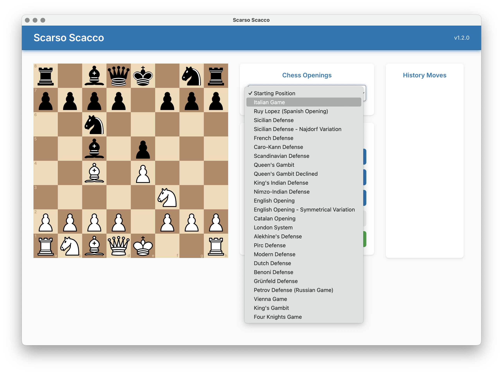

# Scarso Scacco ♟️

A modern chess application built with **Electron** and **React**, featuring integrated **Stockfish AI** engine for intelligent gameplay.




*Main interface showing the chessboard, move history, and control buttons with LinkedIn-inspired design*

## 🛠️ Prerequisites

Before you begin, ensure you have the following installed:

- **Node.js** (v16 or higher) - [Download](https://nodejs.org/)
- **npm** (comes with Node.js)
- **Git** - [Download](https://git-scm.com/)

For Windows builds on macOS/Linux, Wine will be automatically downloaded.

## 📦 Installation

### 1. Clone the Repository

```bash
git clone https://github.com/sensorario/scarsoscacco.git
cd scarsoscacco
```

### 2. Install Dependencies

```bash
npm install
```

## 🏃‍♂️ Development

### Quick Start (Recommended)

```bash
# Start both Vite and Electron automatically
npm run dev:electron
```

This single command will:

- Start the Vite dev server on `http://localhost:5173`
- Wait for Vite to be ready
- Automatically launch Electron with hot reload
- Enable developer tools

### Build All Platforms

```bash
npm run dist
```

### Build Specific Platforms

```bash
# macOS only
npm run dist:mac

# Windows only
npm run dist:win

# Linux only
npm run dist:linux
```

### Build Web Assets Only

```bash
npm run build
```

## 📁 Output Files

Builded files will be found in the `dist/` folder.

## 🎮 How to Play

1. **Make Your Move** - Drag and drop pieces on the board
2. **AI Response** - Stockfish automatically plays the best response
3. **View History** - See all moves in the right panel
4. **Manual AI Move** - Click "Mossa Stockfish" for AI to play when it's your turn
5. **Reset Game** - Click "Reset" to start a new game

## 🧩 Available Scripts

| Script | Description |
|--------|-------------|
| `npm run dev` | Start Vite development server |
| `npm run dev:electron` | Start both Vite and Electron (recommended for development) |
| `npm run build` | Build for production |
| `npm run electron` | Start Electron app |
| `npm run dist` | Build distributables for all platforms |
| `npm run dist:mac` | Build for macOS only |
| `npm run dist:win` | Build for Windows only |
| `npm run dist:linux` | Build for Linux only |
| `npm run lint` | Run ESLint |
| `npm run preview` | Preview production build |

## 🔧 Technologies Used

- **[Electron](https://electronjs.org/)** - Desktop app framework
- **[React](https://react.dev/)** - UI library
- **[Vite](https://vitejs.dev/)** - Build tool and dev server
- **[React Chessboard](https://github.com/Clariity/react-chessboard)** - Chess board component
- **[Chess.js](https://github.com/jhlywa/chess.js)** - Chess game logic
- **[Stockfish.wasm](https://github.com/niklasf/stockfish.wasm)** - Chess engine
- **[Inter Font](https://rsms.me/inter/)** - Modern typography
